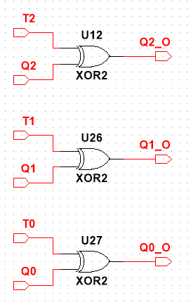

# Technika Cyfrowa - Sprawozdanie 3
## Projekt odtwarzacza MP3

### Autorzy
- Kacper Feliks
- Robert Raniszewski
- Paweł Czajczyk
- Mateusz Pawliczek

## Opis ćwiczenia

Proszę zaprojektować automat mogący posłużyć do sterowania jakimś prostym odtwarzaczem **plików muzycznych mp3.**

Układ powinien mieć następujące przyciski oraz odpowiadające im sygnały i wskaźniki:

- STOP
- PLAY
- NEXT
- PREVIOUS

oraz powinien posiadać **dwubitowe wyjście binarne** określające numer utworu.

## Założenia Projektu

Celem zadania było zaprojektowanie prostego układu MP3 sterowanego przez pojedynczy automat oraz cztery przyciski: `PLAY, STOP, NEXT, PREVIOUS`.

Przyjęto następujące założenia realizacyjne:

- Automat przechowuje informację o **aktualnie odtwarzanym utworze** oraz o tym, czy utwór jest **odtwarzany czy zatrzymany**.

- Zakłada się, że użytkownik **nigdy nie naciska więcej niż jednego przycisku jednocześnie** — w przypadku wykrycia wielu sygnałów wejściowych jednocześnie, układ nie podejmuje żadnej akcji.

- Naciśnięcie przycisku interpretowane jest jako **impuls trwający jeden cykl zegara** (impulsowy sygnał wysokiego poziomu, podobnie jak w przypadku typowego przycisku fizycznego).

- Dodatkowo, naciśnięcie przycisków `NEXT` lub `PREVIOUS` powoduje również wznowienie odtwarzania, jeśli wcześniej muzyka była zatrzymana.

## Projekt Automatu (Alternatywna Koncepcja)

W trakcie projektowania rozważaliśmy kilka możliwych podejść do realizacji zadania. Jedną z alternatywnych koncepcji było wykorzystanie **dwóch osobnych automatów**: jednego do obsługi odtwarzania muzyki, drugiego do zarządzania numerem utworu (ścieżkami).
### Automat do obsługi muzyki 


### Automat do obsługi ścieżek


Choć podejście to pozwalało na czytelne rozdzielenie funkcji, ostatecznie zrezygnowaliśmy z niego — zgodnie z treścią zadania wymagane było użycie **pojedynczego automatu**. W dalszej części opisujemy implementację, którą finalnie przyjęliśmy.

## Projekt automatu (finalna koncepcja)

W finalnej wersji projektu zdecydowaliśmy się na reprezentację stanu odtwarzacza MP3 za pomocą **trzybitowej liczby**. 

- **Najstarszy bit** przechowuje informację o tym, czy muzyka jest aktualnie **odtwarzana (1)**, czy **zatrzymana (0)**.  
- **Dwa młodsze bity** odpowiadają za **numer aktualnego utworu** (od 0 do 3).


Dzięki takiej strukturze automat posiada łącznie **8 unikalnych stanów**, które opisują zarówno status odtwarzania, jak i aktualny utwór. Przejścia między stanami są determinowane przez sygnały z przycisków: `PLAY`, `STOP`, `NEXT`, `PREVIOUS`.

Automat został zaprojektowany tak, aby:
- Wciśnięcie `NEXT` lub `PREVIOUS` powodowało przejście do odpowiedniego utworu.
- Jeżeli muzyka była zatrzymana, to po zmianie utworu **automatycznie następuje wznowienie odtwarzania**.
- Utwory tworzą **cykl zamknięty**, co oznacza możliwość przechodzenia z końca na początek i odwrotnie, np. `00 ➜ 11` oraz `11 ➜ 00`.

---

### Pełny schemat automatu:


### Przejścia dla przycisku `NEXT`:


### Przejścia dla przycisku `PREVIOUS`:


## Koncepcja Schematu Układu

Korzystając z wcześniej przygotowanych projektów Automatu stworzyliśmy układ okreslający potrzebne nam komponenty oraz ich działanie. Jest to nic innego niż teoretyczny sposób na rozwiązanie zadania, który w następnych krokach zrealizowaliśmy. Schemat wygląda następująco:

### Konceptowy Układ z komponentami


### Wyjaśnienie działania układu

Wejścia `NEXT`, `PREV`, `PLAY`, `STOP` to po prostu **przyciski**, które w obecnej implementacji mają formę **przełączników dwustanowych** (mogą przyjmować wartość `0` lub `1`). Aby zasymulować rzeczywiste zachowanie przycisku (czyli krótkiego impulsu), zastosowaliśmy dodatkowy komponent — `INPUT PARSER`. Słuzy on również do blokowania sygnału w przypadku gdy użytkownik wciśnie więcej niż jeden przycisk.

W celu rozwiania wątpliwości — założyliśmy, że do implementacji modułu `COUNTER` wykorzystamy przerzutniki typu T jako bazowe elementy pamięci. Dzięki nim możliwe będzie proste zliczanie oraz zmiana stanu układu przy kolejnych impulsach.

Poniżej znajduje się schemat przykładowej realizacji takiego licznika z przerzutnikami T:


Zmienne T sterują zmianą konkretnych bitów, natomiast zmienne Q odpowiadają za przekazywanie informacji o aktualnym stanie układu.

#### Komponent `INPUT PARSER`

Ten moduł odpowiada za przetwarzanie sygnałów wejściowych z przycisków i składa się z dwóch podkomponentów:

- **`IMPULSE DETECTOR`**  
  Odpowiada za konwersję sygnału trwale wysokiego (`1`) na **pojedynczy impuls**, który trwa maksymalnie **jeden cykl zegara**.

- **`LOGIC`**  
  Zapewnia, że **w danym cyklu aktywny może być tylko jeden przycisk**. W przypadku wykrycia więcej niż jednego aktywnego wejścia, żaden sygnał nie jest przekazywany dalej — zapobiega to niepożądanym reakcjom automatu.

#### Komponent `MP3 LOGIC`

Otrzymuje przetworzone sygnały z `INPUT PARSERA` i analizuje je, generując trzy sygnały sterujące: `T2`, `T1`, `T0`. Każdy z nich informuje, **czy dany bit stanu powinien zostać zmieniony**:
- `T2` — odnosi się do **najstarszego bitu** (odtwarzanie muzyki),
- `T1`, `T0` — odpowiadają za numer utworu (2-bitowy licznik).

#### Komponent `COUNTER`

Na podstawie sygnałów `T2`, `T1`, `T0`, licznik zmienia swój aktualny stan i generuje nowe wartości wyjściowe: `Q2`, `Q1`, `Q0`. Są to aktualne bity stanu automatu:
- `Q2` — informacja o tym, czy muzyka jest odtwarzana (`1`) czy zatrzymana (`0`),
- `Q1`, `Q0` — aktualny numer odtwarzanego utworu.

> Warto zauważyć, że cyfry w nazwach zmiennych `T` i `Q` oznaczają **pozycję bitu**:
> - `T2` i `Q2` — najstarszy bit (odtwarzanie),
> - `T1` i `Q1` — pierwszy bit numeru utworu,
> - `T0` i `Q0` — najmłodszy bit numeru utworu.

#### Wizualizacja wyjść

Sygnały `Q1` i `Q0`, reprezentujące numer utworu, są przesyłane do **wyświetlacza 4-bitowego**, z którego wykorzystujemy jedynie **dwa najmłodsze bity**.  
Sygnał `Q2`, informujący o stanie odtwarzania, steruje **diodą LED podpisaną `PLAYING`** — dioda świeci, gdy muzyka jest odtwarzana.

## Analiza logiki sterującej

Nasz układ ma dwa komponenty logiczne które wymagają analizy pojedyńczych wartości logicznych. Są to `INPUT PARSER ➜ LOGIC` oraz `MP3 LOGIC`. Najpierw przedstawimy analizę wartości logicznych `INPUT PARSERA`, ponieważ od niego zależą wartości logiczne otrzymane w `MP3 LOGIC`.

### INPUT PARSER ➜ LOGIC

Projektowanie tego komponentu rozpoczęliśmy od analizy tablicy wartości logicznych. Układ otrzymuje cztery sygnały wejściowe: `NEXT`, `PREVIOUS`, `PLAY` oraz `STOP`.

Założeniem działania komponentu `LOGIC` jest to, że **wyjście może być aktywne tylko wtedy, gdy dokładnie jeden z sygnałów wejściowych ma wartość `1`**. W przeciwnym wypadku, gdy aktywne są dwa lub więcej wejść, żadne wyjście nie zostaje wygenerowane.

#### Tabela wartości logicznych


Na podstawie analizy uzyskaliśmy następujące zależności logiczne dla sygnałów wyjściowych: `NEXT_O`, `PREV_O`, `PLAY_O`, `STOP_O`:

```
NEXT_O  = ¬(P + PL + ST) · N
PREV_O  = ¬(N + PL + ST) · P
PLAY_O  = ¬(N + P + ST) · PL
STOP_O  = ¬(N + P + PL) · ST
```

Gdzie:
- `N` = `NEXT`
- `P` = `PREVIOUS`
- `PL` = `PLAY`
- `ST` = `STOP`

> Równania można też przedstawić z użyciem operatora NAND lub NOR w zależności od dalszej implementacji w logice sprzętowej.  
> **W naszym projekcie zdecydowaliśmy się jednak na zastosowanie pełnych, nieupraszczanych wyrażeń logicznych** — co ułatwia ich analizę oraz implementację na etapie projektowania układu.


Ostateczne sygnały `NEXT_O`, `PREV_O`, `PLAY_O`, `STOP_O` są przekazywane dalej do komponentu `MP3 LOGIC`, który na ich podstawie decyduje o zmianie stanu odtwarzacza.

### MP3 LOGIC

Projektowanie tego komponentu rozpoczęliśmy od analizy tablicy wartości logicznych. Układ otrzymuje siedem sygnałów wejściowych:

- `Q2, Q1, Q0` – 3-bitowa liczba określająca **obecny stan odtwarzacza MP3**  
- `NEXT, PREV, PLAY, STOP` – sygnały wejściowe przekazane z komponentu **INPUT PARSER**

W celu uproszczenia projektu oraz zmniejszenia liczby rekordów analizowanych w tabelach prawdy, zdecydowaliśmy się na **pominięcie przypadków, w których więcej niż jeden przycisk wejściowy ma wartość `1`**.

Pominięcie to jest uzasadnione, ponieważ w działającym układzie taka sytuacja **nie może wystąpić** – komponent `INPUT PARSER` gwarantuje, że **aktywny może być tylko jeden sygnał wejściowy na raz**.

W tabeli prawdy zastosowano oznaczenia `AQ2, AQ1, AQ0`, które odpowiadają wartościom bitów stanu po zareagowaniu na naciśnięcie przycisku.

Opisane zostały również sekcje wystepujące w tabeli. Oznaczenie pod tytułem `Liczba, Przycisk` np `1 NEXT` opisuje stan czy muzyka gra i wciśnięty przycisk

Dla przejrzystości analiz, każda sekcja tabeli została oznaczona etykietą w formacie Liczba, Przycisk (np. 1 NEXT). Pierwszy człon informuje, czy muzyka była odtwarzana (1) lub zatrzymana (0), a drugi wskazuje, który przycisk został naciśnięty.

#### Logika dla `NEXT` i `PREV`:


#### Logika dla `PLAY` i `STOP`:


---

### Podział logiki MP3 na komponenty funkcjonalne

Aby uprościć proces projektowania oraz analizę logiczną, zdecydowaliśmy się podzielić logikę komponentu `MP3 LOGIC` na cztery osobne bloki odpowiadające każdemu z możliwych sygnałów wejściowych (`NEXT`, `PREV`, `PLAY`, `STOP`).

Każdy z tych bloków — oznaczonych jako `T_NEXT`, `T_PREV`, `T_PLAY`, `T_STOP` — jest aktywny **wyłącznie wtedy**, gdy odpowiadający mu sygnał wejściowy ma wartość `1`. Dzięki temu możemy osobno analizować i projektować logikę zmian bitów tylko dla jednego aktywnego przycisku, co znacząco upraszcza zarówno tablice Karnaugha, jak i późniejszą implementację układu.

W kolejnych podsekcjach przedstawiamy osobno logikę każdego z tych komponentów.

#### Logika `T_NEXT`


#### Logika `T_PREV`


#### Logika `T_PLAY`


#### Logika `T_STOP`


Każdy z powyższych komponentów generuje niezależnie sygnały wyjściowe `T2, T1, T0`, które odpowiadają za ewentualną zmianę odpowiednich bitów stanu (`Q2, Q1, Q0`). Ponieważ tylko jeden z komponentów może być aktywny w danym cyklu (zgodnie z działaniem `INPUT PARSER`), sygnały `T2, T1, T0` z każdego bloku są **łączone logiczną operacją OR**. 

W rezultacie końcowe wartości `T2, T1, T0` są wynikiem działania **jednego aktywnego bloku logicznego**, co upraszcza konstrukcję układu i umożliwia niezależne projektowanie każdego komponentu.

## Implementacja

Po zaprojektowaniu i analizie logiki sterującej przeszliśmy do implementacji kompletnego układu odtwarzacza MP3. W tej części przedstawiamy strukturę całego systemu oraz sposób, w jaki poszczególne komponenty zostały połączone w spójną i działającą całość.

Realizacja zadania została przeprowadzona w programie **Multisim v14.2**.

Poniżej prezentujemy główny schemat układu wraz z porównaniem do zaprojektowanego wcześniej modelu teoretycznego. Opis działania poszczególnych komponentów został przedstawiony we wcześniejszych sekcjach — poniżej skupiamy się na ich wzajemnych połączeniach i zastosowanych uproszczeniach nazw.

---

### Finalny układ


### Komponent `INPUT PARSER`


### Wcześniej zaprojektowany schemat (dla porównania)


---

Finalny układ nie odbiega znacząco od zaplanowanego wcześniej schematu. Wprowadziliśmy jednak kilka drobnych zmian nazewniczych dla większej przejrzystości.

## Przedstawienie komponentów

Poniżej znajduje się schematyczne przedstawienie każdego z głównych komponentów oraz uzasadnienie ich działania. Komponenty są omówione w kolejności odpowiadającej ich przetwarzaniu sygnału — od momentu naciśnięcia przycisku aż do prezentacji danych na wyjściu.

---

### Input Parser ➜ Impulse Detector

Układ `Impulse Detector` odpowiada za przekształcenie sygnału z przycisków (który w symulacji ma postać stałego stanu wysokiego `1`) w impuls trwający **dokładnie jeden cykl zegara**.


Działanie układu opiera się na detekcji **zbocza narastającego** sygnału — czyli momentu, w którym stan zmienia się z `0` na `1`. W tym celu zastosowano **przerzutniki typu D**, które zapamiętują poprzedni stan każdego wejścia (`NEXT`, `PREV`, `PLAY`, `STOP`).

Dla każdego wejścia zastosowano osobny tor:

* Sygnał wejściowy trafia na wejście `D` przerzutnika, a jego wyjście `Q` reprezentuje poprzedni stan.
* Wyjście `Q` podawane jest do bramki NOT, której wynik (`¬Q`) informuje, czy wcześniej był stan niski.
* Jednocześnie bieżący sygnał jest podawany do bramki AND razem z zanegowanym poprzednim stanem.
* W wyniku tego bramka AND wygeneruje impuls (`1`) tylko w chwili zmiany z `0` na `1`.

Dzięki temu sygnał z przycisku zostaje przekształcony w **krótkotrwały impuls** o długości jednego cyklu zegara, co znacząco ułatwia dalsze przetwarzanie sygnałów i eliminuje potencjalne problemy z długimi stanami wysokimi.

---

### Input Parser ➜ Input Logic

Komponent `Input Logic` odpowiedzialny jest za dopuszczenie tylko **jednego aktywnego sygnału wejściowego** w danym cyklu. Jeśli użytkownik naciśnie więcej niż jeden przycisk naraz, układ nie przepuszcza żadnego z nich, zapewniając jednoznaczność i stabilność działania.


Zastosowana logika wynika bezpośrednio z wcześniej przedstawionej analizy funkcjonalnej:


Na podstawie tej tabeli zostały stworzone wyrażenia logiczne dla każdego wyjścia (`NEXT_O`, `PREV_O`, `PLAY_O`, `STOP_O`). Każde z tych wyjść aktywuje się **tylko wtedy**, gdy dany przycisk jest wciśnięty, a pozostałe mają wartość `0`. Taka konstrukcja zapobiega błędnej interpretacji, gdyby użytkownik próbował aktywować kilka funkcji jednocześnie.

---

### Logic

Komponent `Logic` odpowiedzialny jest za przetworzenie danych wejściowych z przycisków `NEXT`, `PREV`, `PLAY`, `STOP` na sygnały sterujące `T2`, `T1`, `T0`, które wskazują, **które bity stanu powinny ulec zmianie**.


W ramach tego podukładu zaimplementowano wcześniej zaprojektowane komponenty `T_NEXT`, `T_PREV`, `T_PLAY`, `T_STOP`, dla których wyznaczone zostały osobne równania logiczne. Każdy z tych podukładów jest aktywny tylko w momencie, gdy odpowiadający mu przycisk jest aktywny (`1`), dzięki czemu logika została uproszczona i rozdzielona na osobne przypadki.

Poniżej przedstawiono zestawienie schematów tych podukładów oraz odpowiadających im tabel Karnaugh:

---

#### Podukład `T_NEXT`

Schemat układu:


Tabela Karnaugh:


---

#### Podukład `T_PREV`

Schemat układu:


Tabela Karnaugh:


---

#### Podukład `T_PLAY`

Schemat układu:


Tabela Karnaugh:


---

#### Podukład `T_STOP`

Schemat układu:


Tabela Karnaugh:


---

### MP3 Controler

Komponent `MP3 Controler` odpowiedzialny jest za **przechowywanie aktualnego stanu odtwarzacza MP3**. Stan ten opisany jest za pomocą 3-bitowej liczby (`Q2, Q1, Q0`), gdzie najstarszy bit (`Q2`) informuje, czy muzyka jest aktualnie odtwarzana, natomiast dwa pozostałe (`Q1, Q0`) wskazują numer ścieżki.

Układ został zrealizowany za pomocą trzech przerzutników typu T, które zmieniają swój stan zgodnie z wartościami `T2`, `T1`, `T0` wyznaczonymi przez moduł `Logic`.


---

Wszystkie wcześniej opisane komponenty, działając wspólnie, realizują funkcjonalność umożliwiającą wybór utworu oraz jego odtworzenie zgodnie z logiką przyjętą w projekcie.

#### Finalny schemat realizujący założone zadanie


## Układ testowy

W celu weryfikacji poprawności działania logiki układu, opracowany został uproszczony układ testowy. Skupiliśmy się w nim na przetestowaniu fragmentów odpowiedzialnych za zmianę stanu utworu oraz jego odtwarzanie i zatrzymywanie — czyli logiki komponentów `LOGIC`, `T_NEXT`, `T_PREV`, `T_PLAY`, `T_STOP`.

Na potrzeby testów:

* **Komponent `MP3 CONTROLER`**, odpowiedzialny za przechowywanie aktualnego stanu (`Q2, Q1, Q0`), został **zastąpiony ręcznie ustawianymi sygnałami wejściowymi**, co pozwoliło na precyzyjne testowanie konkretnych przypadków logicznych.
* **Komponent `INPUT PARSER`** został **uproszczony** — pominięto część odpowiedzialną za detekcję impulsów, skupiając się wyłącznie na reakcjach układu na konkretne, pojedyncze sygnały wejściowe (`NEXT`, `PREV`, `PLAY`, `STOP`).
* **Sygnały `T2, T1, T0`**, będące wynikiem działania logiki, zostały **zmapowane bezpośrednio na linie `Q2, Q1, Q0`** dzięki komponentowi `Logic Converter`, co pozwala zasymulować zachowanie przerzutników typu T oraz obserwować zmiany stanu układu na podstawie ich aktywacji.

Tak zbudowany układ pozwolił sprawdzić, czy logika w każdej sytuacji generuje poprawne sygnały zmiany stanu i czy odpowiadają one oczekiwanym zachowaniom systemu.

#### Realizacja układu testowego


#### Co umożliwia układ testowy?

Układ testowy pozwala na weryfikację poprawności działania poszczególnych elementów logicznych systemu. W przypadku wystąpienia błędu, system zwraca informacje, które umożliwiają dokładną analizę przyczyn nieprawidłowości, dzięki czemu diagnostyka jest znacznie prostsza.

Przykładowe sygnały zwracane do analizatorów stanów logicznych przedstawiono poniżej:


Testowanie przebiega cyklicznie, poprzez generowanie wartości wejściowych `NEXT`, `PREV`, `PLAY`, `STOP`, a także aktualnego stanu `Q2`, `Q1`, `Q0` oraz oczekiwanych wartości `EX_Q2`, `EX_Q1`, `EX_Q0`, które są dostarczane przez generator słów.

Przykładowe dane z generatora słów:


---

### Opis działania komponentów układu testowego

Część komponentów wykorzystywanych w układzie testowym jest identyczna jak w podstawowym projekcie, dlatego ich opis zostanie pominięty. Jednakże, dla potrzeb testów konieczne było zaprojektowanie kilku nowych modułów.

---

### Logic Converter



Komponent `Logic Converter` realizuje przekształcenie sygnałów `T` na odpowiadające im zmiany stanów `Q`, zgodnie z równaniem:

```
Q_OUT = ¬Q · T + Q · ¬T
```

|Q|T|OUT_Q|
|-|-|-|
|0|0|0|
|0|1|1|
|1|0|1|
|1|1|0|

Równanie to odpowiada działaniu przerzutnika typu T i upraszcza się do operacji XOR:

```
Q_OUT = Q ⊕ T
```

Dzięki temu możliwa jest symulacja zmiany stanu bitów na podstawie sygnałów `T` bez fizycznej implementacji przerzutników, co upraszcza konstrukcję układu testowego i przyspiesza weryfikację logiki.


---

### Tester

Moduł `Tester` odpowiada za porównywanie wartości faktycznych z wartościami oczekiwanymi oraz sygnalizowanie wystąpienia błędów. W przypadku różnicy między aktualnym stanem (`Q2, Q1, Q0`) a wartością oczekiwaną (`EX_Q2, EX_Q1, EX_Q0`), układ generuje odpowiedni sygnał błędu.

Układ rozróżnia dwa typy błędów:

* **Błędy lokalne** — dotyczą pojedynczych bitów `Q2`, `Q1`, `Q0` i są sygnalizowane indywidualnymi diodami LED na module testowym.
* **Błąd globalny** — aktywowany przy pierwszym wykrytym błędzie i pozostaje aktywny do zakończenia testu, co pozwala na szybkie wykrycie problemu w całym systemie.

Wszystkie sygnały błędów są dostępne na wyjściach modułu, co umożliwia ich podłączenie do systemów monitorujących oraz dalszą analizę.


---

### Tester ➜ ERR Detector

Moduł `ERR Detector` odpowiada za porównanie wartości oczekiwanych z rzeczywistymi dopiero w momencie wykrycia spadku sygnału na wejściu `READY`. Wejście to sygnalizuje gotowość generatora słów, co oznacza, że wartości są stabilne i można je bezpiecznie wykorzystać do porównań.

Wykrywanie spadku napięcia zostało zastosowane celowo, aby dać czas pozostałym komponentom na wykonanie swojej logiki i ustabilizowanie sygnałów. Dzięki temu unikamy błędów wynikających z opóźnień i desynchronizacji pomiędzy elementami systemu.

Działanie `ERR Detector` jest analogiczne do modułu `Impulse Detector`, jednak w przeciwieństwie do niego wykrywa **spadek** napięcia, podczas gdy `Impulse Detector` reaguje na jego wzrost.


## Inne zastosowania

Projektowany układ może znaleźć zastosowanie także poza funkcją odtwarzacza MP3. Świetnie sprawdziłby się jako kontroler wyświetlania treści reklamowych na ekranie telewizora lub monitora. Mając do dyspozycji cztery różne reklamy, układ umożliwiałby wybór i odtwarzanie jednej z nich.

Dodatkowo, możliwe jest rozbudowanie systemu o funkcję automatycznej zmiany reklam, które wówczas byłyby wyświetlane kolejno, jedna po drugiej, co pozwoliłoby na dynamiczne i efektywne zarządzanie prezentacją treści.


