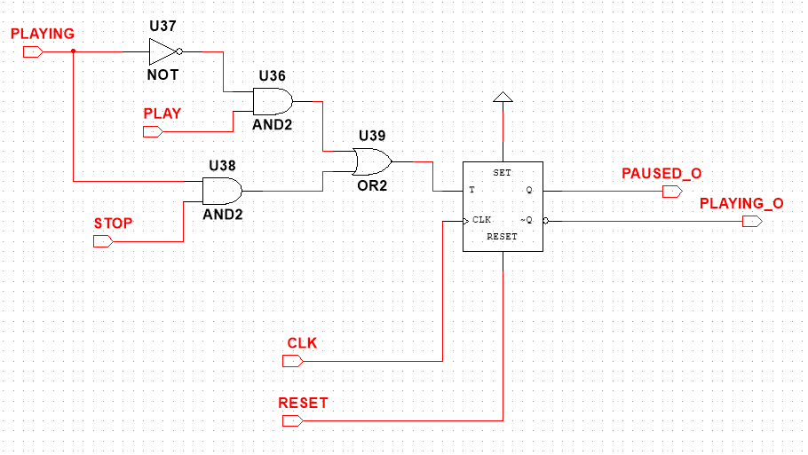

# Technika Cyfrowa - Sprawozdanie 3
## Projekt odtwarzacza MP3

### Autorzy
- Kacper Feliks
- Robert Raniszewski
- Paweł Czajczyk
- Mateusz Pawliczek

## Opis ćwiczenia

Proszę zaprojektować automat mogący posłużyć do sterowania jakimś prostym odtwarzaczem **plików muzycznych mp3.**

Układ powinien mieć następujące przyciski oraz odpowiadające im sygnały i wskaźniki:

- STOP
- PLAY
- NEXT
- PREVIOUS

oraz powinien posiadać **dwubitowe wyjście binarne** określające numer utworu.

## Pomysł na rozwiązanie

Ta część poświęcona jest krótkiemu przedstawieniu naszej idei rowiązania tego zadania oraz przedstawienia komponentów które potrzebowaliśmy stworzyć lub zaimplementować w celu jego realizacji. Dokłądny opis każdego z komponentów oraz wizualizacji ukłądów znajduje się w sekcji **Implementacja Rozwiązania**

Do stworzenia ukłądu któy posłużyłby jako odtwarzacz plików muzycznych MP3 wykorzystaliśmy:

- #### Dwubitowy licznik

Odtwarzacz będzie umożliwiał odsłuchanie jednego z 4 wybranych utworów. Numer utworu zostanie zapisany za pomocą stworzonego przez nas komponentu **(Dwubitowego Licznika)**, który dzięki przerzutnikom typu T zapisuje na dwóch bitach numer utworu, który następnie zostaje wyświetlony na **dwubitowym wyświetlaczu**.

- #### Komponent logiki zmian

Układ dostaje sygnały **NEXT** (zmiany utworu na następny) oraz **PREVIOUS** (zmianu utworu na poprzedni). **Komponent logiki zmian** odpowiada za aktualizację licznika w zależności od wybranej akcji `(NEXT lub PREVIOUS)`

**Przypadek wciśnięcia NEXT**

Komponent pobiera wartość z licznika i aktualizuje ją na następną w kolejności liczbę. Jeżeli liczba w fromacie bitowym przed aktualizacją wynosi 3 zmienia się na 0.

`0 ➜ 1 ➜ 2 ➜ 3 ➜ 0 ➜ 1 ➜ (...)`

**Przypadek wciśnięcia PREVIOUS**

Komponent pobiera wartość z licznika i aktualizuje ją na poprzednią w kolejności liczbę. Jeżeli liczba w fromacie bitowym przed aktualizacją wynosi 0 zmienia się na 3.

`3 ➜ 2 ➜ 1 ➜ 0 ➜ 3 ➜ 2 ➜ (...)`

- #### Komponent statusu granej muzyki

Odtwarzacz umożliwia również możliwość zatrzymania utworu przyciskiem **STOP** oraz wznowienia słuchania przyciskiem **PLAY**. 

**Komponent statusu granej muzyki** obsługuje logikę zatrzymania i wznowienia słuchania oraz informacje o stanie granego utworu.

Dodatkowo jeżeli muzyka jest zatrzymana, a zajdzie zmiana stanu licznika (wciśnięcie `NEXT` lub `PREVIOUS`) stan odtwarzacza muzyki ustawi się na odtwarzanie `( PLAYING )`. 

- #### Parsery wejść

Parser umożliwia nam kontrolowanie wejść przycisków **NEXT, PREVIOUS, PLAY, STOP**. Pełni on dwie funkcje:

1. Parser upewnia się, że wyjście z każdego przycisku trwa nie dłużej niż jeden takt zegara (zachowanie przypominające naciśnięcie i odpuszczenie przycisku)

2. Parser blokuje możliwość wciśnięcia dwóch przycisków na raz (PLAY I PAUSE lub NEXT I PREVIOUS). 

> Warto dodać, że kliknięcie jednego z przycisków do wyboru muzyki oraz jednego z przycisków do odtwarzania lub zatrzymania muzki na raz jest możliwe, ponieważ ta akcja nie konfilktuje ze sobą logiki komponentów.

#### Podsumowanie pomysłu na rozwiązanie

Wszystkie przedstawione komponenty razem pozwalają nam na wybranie numeru utworu oraz jego odtworzenie lub zatrzymanie.

Pewnie, oto poprawiona wersja Twojego opisu — z ładniejszym brzmieniem, poprawionym językiem oraz dopisanym wyjaśnieniem o alternatywnym podejściu:

---

## Schemat działania automatu

**Typ automatu: Mealy**

Automat realizuje dwie funkcje:

* wybór (aktualizację) numeru odtwarzanego utworu,
* kontrolę stanu odtwarzania (muzyka gra lub jest zatrzymana).

Zarówno stan wewnętrzny automatu, jak i sygnały pochodzące od użytkownika (naciśnięcia przycisków), wpływają na jego działanie. Ponieważ wyjścia zależą jednocześnie od aktualnego stanu oraz sygnału wejściowego, mamy do czynienia z automatem typu **Mealy**.

Automat umożliwia również rozpoczęcie odtwarzania muzyki przy pomocy przycisków zmiany utworu, co dodatkowo zwiększa jego funkcjonalność.

W rezultacie wyróżniamy 8 możliwych stanów automatu:

```
000 – utwór 0, zatrzymany
100 – utwór 0, odtwarzany

001 – utwór 1, zatrzymany
101 – utwór 1, odtwarzany

010 – utwór 2, zatrzymany
110 – utwór 2, odtwarzany

011 – utwór 3, zatrzymany
111 – utwór 3, odtwarzany
```

Do zmiany stanów służą cztery przyciski sterujące:

```
STOP  – zatrzymuje muzykę  
PLAY  – wznawia odtwarzanie  
NEXT  – przechodzi do następnego utworu i wznawia odtwarzanie, jeśli było zatrzymane  
PREV  – przechodzi do poprzedniego utworu i wznawia odtwarzanie, jeśli było zatrzymane  
```

Schemat działania automatu przedstawiony jest poniżej:


> **Uwaga:**
Na etapie projektowania rozważano również alternatywne podejście polegające na rozdzieleniu funkcji wyboru utworu i kontroli odtwarzania na dwa oddzielne automaty. Takie rozwiązanie mogłoby uprościć zarówno logikę przejść, jak i sam schemat, dzięki rozdzieleniu odpowiedzialności na dwa mniejsze, bardziej przejrzyste bloki funkcjonalne.


## Implementacja Rozwiązania

#### Licznik

Licznik, który został stworzony do realizacji tego zadania jest licznikiem szeregowym i jego układ wygląda następująco:


Przerzutnik z podpiętym wejściem T1 to najstarszy bit a przerzutnik z wejściem T0 to najmłodszy bit. Razem tworzą dwubitowy licznik zdolny do przechowywania w pamięci 
liczb (0, 1, 2, 3).

Wyjścia Q opisują obecny stan licznika, a wejścia T umożliwiają jego zmianę.

Na obrazku widać również brakujące wyjście `~Q1`, jest to zabieg celowy, ponieważ negatywna wartość logiczna zmiennej `Q1` nie znalazła zastosowania w układzie zatem została pominięta.

#### Parsery Wejść

Kolejne komponenty używają wejść `PLAY`, `STOP` oraz `NEXT` i `PREVIOUS`. Każda z tych zmiennych zanim trafi do komponentu przechodzi przez Parser, którego zadaniem jest upewnienie się, że nie są wciskane na raz oraz przekazanie sygnału, który trwa dokładnie jeden cykl zegara.

Pozwala to nam na synchronizacje z licznikiem i umożliwienie przeskoku o dokładnie jeden utwór.


W układzie wykorzystano dwa przerzutniki D (U25 i U27), które zapamiętują sygnały `STOP` i `PLAY` na narastającym zboczu zegara CLK. Dzięki temu nawet krótki impuls zostaje "złapany" i utrzymany przez jeden cykl zegara.

Wyjścia przerzutników trafiają do bramek logicznych, które tworzą impulsy `STOP_O` i `PLAY_O` – ale tylko wtedy, gdy sygnał `STOP` lub `PLAY` został wykryty samodzielnie (bez drugiego sygnału aktywnego w tym samym czasie). Dzięki temu układ blokuje jednoczesne uruchomienie obu funkcji.

#### Komponent Logiki Zmian

Implementacja logiki zmian licznika wymagała rozpatrzenia oraz rozpisania wartości logicznych, które komponent otrzymuje na wejściu oraz jak mają one zmieniać stan licznika.

Komponent przyjmuje wartości `Q1, ~Q1` (stan starszego bitu) oraz `Q0, ~Q0` (stan młodszego bitu). Dodatkowo również otrzymuje wartość `NEXT` oraz `PREVIOUS`. Każde z tych wejść może mieć wartość 0 lub 1.

`WEJŚCIA`
```
Q0 - bit najmłodszy
~Q0 - negacja bitu najmłodszego
NEXT - czy zmienić na następny utwór
PREVIOUS - czy zmienić na poprzedni utwór
```

> Brakujące wartości wejścia dla `Q1` oraz `~Q1` nie są błędem. W etapie dotyczącym wyznaczenia wartości T1 oraz T0 w zależności od wartości NEXT i PREVIOUS zostanie wyjaśniona ta decyzja!

Na końcu komponent zwraca nam na wyjściach `T1 oraz T0` czy dany bit ma być zmieniony czy nie.

`WYJŚCIA`
```
T1 - zmiana, najstarszy bit
T0 - zmiana, najmłodszy bit
```

Ta informacja jest przesyłana do licznika na wejścia `T1 oraz T0`.

Tabela predstawiająca wszystkie wartości logiczne oraz zmiany bitów (Negacje Q zostały pominięte nie są one istotne w wyznaczaniu wartości logicznych) wygląda następująco:

|Q1|Q0|NEXT|PREVIOUS|Q1 AFTER|Q0 AFTER|T1|T0|
|--|--|----|--------|--------|--------|--|--|
|0|0|1|0|0|1|0|1|
|0|1|1|0|1|0|1|1|
|1|0|1|0|1|1|0|1|
|1|1|1|0|0|0|1|1|
|0|0|0|1|1|1|1|1|
|1|1|0|1|1|0|0|1|
|1|0|0|1|0|1|1|1|
|0|1|0|1|0|0|0|1|

Przypadki gdy PREVIOUS oraz NEXT są równe nie zostały rozpatrzone, ponieważ nie chcemy wtedy podejmować żadnych akcji. Warto dodać, że taka sytuacja nigdy nie będzie miałą miejsca ze względu na **Parsery**, które blokują taką możliwość.

Wartość T0 oraz T1 chcemy przekazać do `Countera` tylko wtedy gdy użytkownik wciśnie przycisk. Zatem T1 oraz T0 wymaga wysokiej wartości `PREVIOUS` lub `NEXT`.

Dlatego logikę zmian możemy przedstawić w formie dwóch tabel Karnaugh `T1_NEXT` zależnego od `NEXT` i `T0_PREV` zależnego od `PREV`.

- **T1_NEXT**

`Wartość T1`

|Q0\Q1|0|1|
|-----|--|--|
|0|0|0|
|1|1|1|

```
T1 = ( (Q0 * ~Q1) + (Q0 * Q1) ) * NEXT
T1 = ( Q0 * (Q1 + ~Q1) ) * NEXT
T1 = Q0 * NEXT
```

`Wartość T0`

|Q0\Q1|0|1|
|-----|--|--|
|0|1|1|
|1|1|1|

Q0 oraz Q1 nie wpływa na zmianę T0 więc:

```
T0 = 1 * NEXT
T0 = NEXT
```

- **T0_PREV**

`Wartość T1`

|Q0\Q1|0|1|
|-----|--|--|
|0|1|1|
|1|0|0|

```
T1 = ( (~Q0 * ~Q1) + (~Q0 * Q1) ) * PREVIOUS
T1 = ( ~Q0 * (~Q1 + Q1) ) * PREVIOUS
T1 = ~Q0 * PREVIOUS
```

`Wartość T0`

|Q0\Q1|0|1|
|-----|--|--|
|0|1|1|
|1|1|1|

Q0 oraz Q1 nie wpływa na zmianę T0 więc:

```
T0 = 1 * PREVIOUS
T0 = PREVIOUS
```

Po analizie otrzymanych przez nas wartości T1 oraz T0 dla NEXT i PREVIOUS zdecydowaliśmy usunąć zbędne wejścia, które nie są wymagane do kalkulacji zmiany T1 oraz T0. Dlatego przedstawiona na początku tabela wejść nie zawierała wartości logicznych dla `Q1, ~Q1`

Ostatecznie układ tego komponnetu wyglądał następująco:

**Komponent Logiki Zmian**


**T1 NEXT**


**T1 PREV**


Ukłąd logiki został podpięty do licznika i razem tworzą pętlę uzależnioną od wartości `NEXT` i `PREVIOUS`

Wejście **CLK** ukłądu Counter jest podpięte do zegara o częstotliwości 120 Hz. Pozwala to na synchronizację przerzutników typu T.


#### Komponent statusu granej muzyki

Implementacja układu odpowiadającego za zatrzymywanie oraz wznawianie muzyki jest układem który działa osobno od elementu licznika. To czy dana muzyka gra lub nie, nie ma wpływu na wartość licznika i odwrotnie.

Komponent posiada 4 wejścia.

```
PLAY - Zacznij odtwarzać
STOP - Zatrzymaj muzykę
PLAYING - Czy muzyka obecnie gra
CLK - Zegar (do synchronizacji)
```

Po przeprowadzeniu logiki komponent zwraca nam informacje na 2 wyjścia

```
PLAYING_O - Muzyka gra
STOPPED_O - Muzyka jest zatrzymana (negacja PLAYING_O)
```

Wartości logiczne tego układu możemy przedstawić w formie tabeli:

|PLAYING|PLAY|STOP|PLAYING AFTER|T|
|-------|----|----|-------------|-|
|0|1|0|1|1|
|1|1|0|1|0|
|0|0|1|0|0|
|1|0|1|0|1|

`T` określa czy stan `PLAYING` zmienił się po wciśnięciu dowolnego z przycisków.

Ponownie Parser uniemożliwia odpalenie `PLAY` oraz `STOP` na raz zatem nie rozpatrujemy przypadków gdy `PLAY` oraz `STOP` są sobie równe.

Z otrzymanej tabeli możemy wyprowadzić równanie logiczne zmiennej T w zależności od `PLAYING`, `PLAY` oraz `STOP`

```
T = ~PLAYING * PLAY + PLAYING * STOP
```

Parametr `T` został podpięty do przerzutnika, który przekazuje wartości `Q` i `~Q` na wyjścia `PLAYING_O` oraz `STOPPED_O`.

**Zmiana stanu przy NEXT i PREVIOUS**

Mechanizm zmiany stanu odtwarzania muzyki podczas przełączania utworów został zrealizowany przy użyciu przerzutnika typu T. Przerzutnik ten umożliwia ustawienie wyjścia w stan niski (0) poprzez sygnał `RESET`.

Wyjścia sygnałów `NEXT_O` oraz `PREV_O` zostały podłączone do wejścia RESET przerzutnika, co pozwala na automatyczne wznawianie odtwarzania muzyki po zmianie utworu. Dzięki temu każda zmiana utworu (na poprzedni lub następny) powoduje wyzerowanie stanu „zatrzymania”, a muzyka zaczyna grać od razu po przełączeniu.

Finalnie układ wygląda następująco:



Wyjścia `PLAYING_O` oraz `PAUSED_O` są podpięte do niebieskich diod, które informują o obecnym stanie wybranego utworu (czy jest odtwarzany lub nie).


## Finalny układ

Wszystkie wymienione wcześniej komponenty pozwalają nam stworzyć układ, który może być wykorzystany jako prosty odtwarzać muzyki MP3.


Układ ten:

- Zabezpiecza przed jednoczesnymi przyciśnięciami przycisków `NEXT` i `PREV` oraz `STOP` i `PLAY`.
- Posiada licznik dwubitowy zdolny do przechowywania informacji o obecnym utworze.
- Posiada wyświetlacz, który pokazuje numer obecnie granego utworu.
- Umożliwia zatrzymanie lub wznowienie słuchania utworu.
- Posiada diody informujące o stanie muzyki, czy jest ona obecnie odtwarzana czy też nie.

## Układ testujący

Aby umożliwić sprawdzenie działalności układu dodano urządzenia do analizy wartości logicznych (logic analyzer) oraz generator słów który razem z komponentem `tester` pozwala na sprawdzanie poprawności działania.


#### Parser Input Analyzer

Umożliwia sprawdzenie stanu zmiennych `STOP`, `PLAY`, `NEXT`, `PREV` przed wejściem do `Input Parsera` oraz na jego wyjściu. 

Przykładowe odczyty z analizatora:


#### Counter Value and Change Logic Analyzer

Umożliwia sprawdzenie stanu zmiennych `Q0` i `Q1` przekazywanych do wyświetlacza dwubitowego, zmiennych `NEXT_O` i `PREV_O` w celu pokazania kiedy użytkownik wcisnął przycisk oraz `T0` i `T1` w celu sprawdzenia czy komponent `Change Logic` poprawnie przekazuje wartości określające zmiany bitowe w `Counter`.

Przykładowe odczyty z analizatora:


#### Music Status Analyzer

Umożliwia sprawdzenie zachowania przycisków `STOP_O` oraz `PLAY_O` i ich wpływu na wartość `PLAYING`. Wartość `STOPPED` nie została podpięta do ukłądu gdyż jest ona równa `~PLAYING`

Przykładowe odczyty z analizatora:


#### Tester i Generator Słów

Ten podukład pozwala sprawdzić poprawność działania automatu. `Tester` porównuje otrzymywane na wyjściu wyniki z oczekiwanymi, które są podane wewnątrz generatora słów.

Przykładowe wartości generatora słów.


Pierwsze 4 bity odpowiadają wartościom `PLAY, STOP, PREV, NEXT`. 9, 10 oraz 11 bit opisują kolejno oczekiwane wartości `Q0, Q1, PLAYING`.

Wartości są porównywane w testerze.


Dioda testera zapala się cyklicznie. Cykliczne zapalanie diody nie oznacza błędu. Dopiero jej stałe zapalenie świadczy o błędzie w układzie.

> Sprawdzenie poprawności programu powinno nastąpić po błyśnięciu diody `Cycle Start`. Wtedy licznik jest zresetowany a kursor generatora słów jest ustawiony na początek.

## Inne zastosowania

Układ sprawdziłby się także w roli kontrolera treści reklamowych wyświetlanych na ekranie telewizora / monitora. Z dostępnych 4 reklam odtwarzałby jedną wybraną.

Można by również dodać do tego układu możliwość automatycznej zmiany reklamy, które wtedy wyświetlały by się jedna po drugiej.

